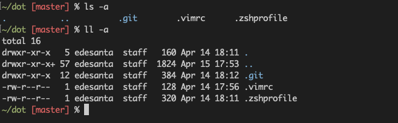
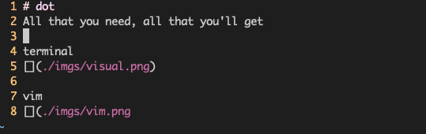

# dot
All that you need, all that you'll get

terminal   

vim     

### Installation   
move the dots    
`mv dot/.* ~/`

source `.zshprofile` in your `.zshrc`:   
`echo "source .zshprofile ~/.zshrc`    
btw, I use vi keybindings in the command line! 

got to terminal, settings and add the `afterglow.terminal` theme
